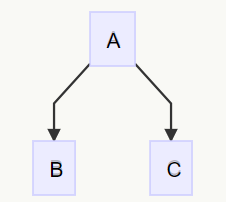
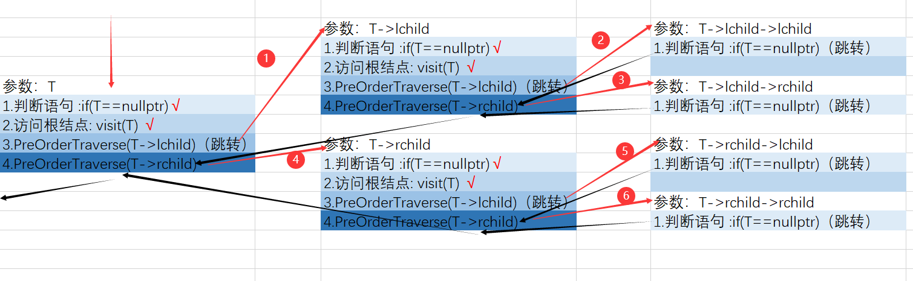

# 树

|      Part I      |      Part II       |
| :--------------: | :----------------: |
| [二叉树](#part1) | [哈夫曼树](#part2) |

## 二叉树


### 满二叉树


- 满二叉树在同样深度的二叉树中结点个数最多
- 满二叉树在同样深度的二叉树中叶子节点个数最多

### 完全二叉树


特点：
1. 叶子节点只能分布在层次最大的两层上
2. 对任一节点，如果其右子树的最大层次为 i，则其左子树的最大层次必为 i 或 i+1

*完全二叉树的性质*

性质4 


性质5


性质5表明了完全二叉树中双亲结点编号与孩子结点编号之间的关系

### 顺序存储

实现：按满二叉树的结点层次编号，依次存放二叉树中的数据元素。


二叉树顺序存储表示


```C
// 定义二叉树的最大节点数为100
#define MAXTSIZE 100
// 使用typedef定义一个新类型SqBiTree，它是一个大小为MAXTSIZE的TElemType类型数组
typedef TElemType SqBiTree[MAXTSIZE];
// 声明一个顺序存储的二叉树变量bt
SqBiTree bt;
```

例如

```c
// 定义常量MAXTSIZE，指定二叉树顺序存储结构的最大节点数量为100
#define MAXTSIZE 100

// 假设TElemType是二叉树节点存储的数据类型，例如int、char或其他自定义类型
typedef int TElemType; // 这里以int为例，根据实际情况可以更改

// 使用typedef定义一个新类型SqBiTree，它是一个大小为MAXTSIZE的TElemType类型数组
// 这个数组用于顺序存储二叉树的节点数据
typedef TElemType SqBiTree[MAXTSIZE];
```

二叉树的顺序存储缺点


### 链式存储


二叉链表存储结构

```c
typedef struct BiNode{
	TElemType data;
	struct BiNode *lchild,*rchild;
}BiNode,*BiTree;
```


空指针域


三叉链表

```c
 typedef struct BiNode{
	TElemType data;
	struct BiNode *lchild, *parent, rchild;
}BiNode,*BiTree;
```


### 遍历二叉树

*遍历定义*：顺着某一条搜索路径寻访二叉树中的结点，使得每个结点均被访问一次，而且仅被访问一次（又称周游）

- “访问” 的含义很广，可以是对结点作各种处理，如：输出结点的信息，修改结点的数据值等，但要求这种访问不破坏原来的数据结构

*遍历目的*：得到树中所有结点的一个线性排列

*遍历用途*：它是树结构插入、删除、修改、查找和排序运算的前提，是一切运算的基础和核心

*遍历方法*


 

*二叉树的定义*

~~~cpp
struct BiNode
{
    ElemType data;
    BiNode *lchild, *rchild;
} *BiTree;
~~~

*二叉树的先序遍历 DLR*

~~~cpp
bool PreOrderTraverse(BiTree &T)
{
    if(T == nullptr)
    {
        return true;
    }
    //访问根结点
    visit(T);
    //递归遍历左孩子
    PreOrderTraverse(T->lchild);
    //递归遍历右孩子
    PreOrderTraverse(T->rchild);
     return true;
}
~~~

> 如何理解这个算法？通过画图，描述函数的调用时机，其实还是比较简单
>
> 以这个三结点的二叉树为例

*三结点二叉树*



*算法执行过程*  




*二叉树的中序遍历 LDR*

~~~cpp
bool InOrderTraverse(BiTree &T)
{
    if (T == nullptr)
    {
        return true;
    }
    //第一步：访问左孩子
    InOrderTraverse(T->lchild);
    //第二步：访问根结点
    visit(T);
    //第三步：访问右孩子
    InOrderTraverse(T->rchild);
    return true;
}
~~~

*二叉树的后序遍历 LRD*

~~~cpp 
bool PostOrderTraverse(BiTree &T)
{
    if (T == nullptr)
    {
        return true;
    }
    //第一步：访问左孩子
    PostOrderTraverse(T->lchild);
    //第二步：访问右孩子
    PostOrderTraverse(T->rchild);
    //第三步：访问根结点
    visit(T);
    return true;
}
~~~

> 三种算法的时间复杂度：O(n)，空间复杂度：O(n)
>
> 三种算法的思想都是DFS（深度优先算法）


算数表达式二叉树的遍历


*求二叉树*

已知前序序列和中序
或者 已知后序序列和中序
都可以求二叉树


利用后序序列确定根
中序序列确定根左右的元素

中序序列确定左右元素后，从后序序列观察左边的元素的关系，确定左边元素的新根


*二叉树的中序遍历——非递归算法*


~~~cpp
void LDR(BiTree &T)
{
    //第一步：创建一个栈，用于保存二叉树的结点
    SqStack S;
    InitSqStack(S);
    BiTree p = T;
    while( p || !IsEmpty(S))
    {
        if(p)
        {
            Push(S, p);
            p = p->lchild;
        }
        else
        {
            Pop(S, p);
            visit(p);
            p = p->rchild;
        }
    }
}
~~~

核心是模仿递归的栈操作

进入新子树Push根，一层左子树消亡后，弹出并使用根，进入右子树

*二叉树的层次遍历算法*

队列类型定义

```c
typedef struct{
	BTNode data[MaxSize];
	int front,rear;
}SqQueue;
```

~~~cpp
void LevelOrder(BiTree &S)
{
    /*
    算法设计思路：
    1. 将根结点入队
    2. 队列不为空时循环，从队列中出列一个元素，访问它，并作以下步骤：
        2.1 如果该元素的左孩子不为空，让该元素的左孩子入队
        2.2 如果该元素的右孩子不为空，让该元素的右孩子入队
    */
    SqQueue Q; // 定义一个队列
    InitSqQueue(Q); // 初始化队列

    BiTree p; // 定义一个二叉树指针变量，用于存储队列中的节点
    PushQueue(Q, S); // 将根节点入队

    while (!QueueEmpty(Q)) // 当队列不为空时循环
    {
        // 将队列中的节点出队
        DeQueue(Q, p);
        // 访问出队的节点
        cout << p->data << endl; // 输出节点的数据

        // 检查左孩子是否存在，如果存在则入队
        if (p->lchild != nullptr)
        {
            PushQueue(Q, p->lchild);
        }
        // 检查右孩子是否存在，如果存在则入队
        if (p->rchild != nullptr)
        {
            PushQueue(Q, p->rchild);
        }
    }
}
~~~

***二叉树的建立（DLR先序遍历，递归算法）***

~~~cpp
bool CreatBiTree(BiTree &T)
{
    ElemType input;
    cin >> input;
    if(input == -1)//建立空结点的标志为 -1（这个自己设定一个就好）
        return false;
    T = new BiNode;
    //D
    T->data = input;
    //L
    CreatBiTree(T->lchild);
    //R
    CreatBiTree(T->rchild);
    return true;
}
~~~

*二叉树的复制*

~~~cpp
bool CopyBiTree(const BiTree &T, BiTree &NewT)
{
    if(T == nullptr)
    {
        return false;
    }
    NewT = new BiNode;
    //D
    NewT->data = T->data;
    //L
    CopyBiTree(T->lchild, NewT->lchild);
    //R
    CopyBiTree(T->rchild, NewT->rchild);
    return true;
}
~~~

*求二叉树的深度*

~~~cpp
int Depth(BiTree &T)
{
    if(T == nullptr)
    {
        return 0;
    }
    int m = Depth(T->lchild);
    int n = Depth(T->rchild);
    if(m>n)
        return m+1;
    else
        return n+1;
}
~~~

> ​	如何理解这个算法？
>
> 在我看来，二叉树的深度计算算法，是把二叉树的递归调用运用的淋漓尽致
>
> 首先，二叉树 = 根结点+左子树+右子树；右子树=根结点+左子树+右子树；左子树=根结点+左子树+右子树。。。如此循环反复，因此，我们对二叉树模型进行运算，只需要像剥洋葱一样，一层一层把二叉树剖开，把一个复杂二叉树的运算求解问题，分解成一个个的单结点二叉树（叶子结点）问题的累加，就会比较方便
>
> 这个深度计算算法，就是这个思想。用递归函数一层层分解二叉树，递归的到叶子结点。例如，当我们第一个叶子结点的的左孩子和右孩子都是空时，叶子结点的m和n都等于0，再通过一个if判断语句，让m和n中的较大值加1。也即叶子结点返回1，这个返回值就放在叶子结点的双亲的m中，再去看这个双亲的右孩子，循环反复，最后就能得到二叉树的深度。

*求二叉树的结点数*

~~~cpp
int CountNode(BiTree &T)
{
    if (T == nullptr)
    {
        return 0;
    }
    // //L
    // int m = CountNode(T->lchild);
    // //R
    // int n = CountNode(T->rchild);
    // //
    // return m + n + 1;
    //更加简单的语句
    return CountNode(T->lchild) + CountNode(T->rchild) + 1;
}
~~~

*求二叉树的叶子结点数*

~~~cpp
//王卓老师的视频范例
int Count0Node(BiTree &T)
{
    //③：递归函数将上一个结点剖分成左右子树，如果结点的孩子为空，那么返回0
    //这里不会出现结点的两个孩子都是空的，因为上一个结点执行这个递归函数的时候就已经判断了这种情况
    //这个语句只是为了以下两种情况而存在的：
    //1. 空树
    //2. 某个分支结点只有一个孩子
    if (T == nullptr)
    {
        return 0;
    }
    //①：其实呢，我们还是可以把这个问题拆分成左子树和右子树的统计问题
    if (T->lchild == nullptr && T->rchild == nullptr)
    {
        //以T为根结点的这棵树，左右孩子都没有，那他就是叶子结点
        return 1;
    }
    //②：如果不是这个情况，就说明这个根结点至少有一个孩子，还要继续剖分这个结点
    return Count0Node(T->lchild) + Count0Node(T->rchild);
}
~~~

~~~cpp
//我自己写的程序，确实有一点拉胯
/*
参数n：用于统计叶子结点数
参数flag：用于判断某个结点的两个孩子是否都为空
*/
bool Count0Node(BiTree &T, int &n, int &flag)
{
    if (T == nullptr)
    {
        flag = 1; //标志
        return false;
    }
    if (flag == 1)
    {
        ++n;
        flag = 0;
    }
    //L
    Count0Node(T->lchild, n, flag);
    //R
    Count0Node(T->rchild, n, flag);
    return true;
}
~~~

***

<span id="part2">**哈夫曼树**</span>

*哈夫曼树的定义*

~~~cpp
typedef struct HNode
{
    int weight;                 //权重
    int parent, lchild, rchild; //每个结点的双亲、左右孩子的数组下标
} * HuffmanTree;
~~~

*哈夫曼树的初始化*

~~~cpp
void InitHTree(HuffmanTree &H, const int n)
{
    //哈夫曼树的存储结构为顺序存储
    //由哈夫曼树的构造过程得知，n个权重结点构造出的哈夫曼树具有2*n-1个结点
    //通常哈夫曼树的顺序存储结构下标从1开始计数，因此，如果我们使用数组实现的话
    //那么数组的长度应该是2*n
    H = new HNode[2 * n];
    for (int i = 1; i < 2 * n; ++i)
    {
        H[i].parent = H[i].lchild = H[i].rchild = 0;//右结合律
    }
    int input;
    for (int i = 1; i <= n; ++i)
    {
        cin >> input;
        H[i].weight = input;
    }
}
~~~

*哈夫曼树的构造算法*

~~~cpp
void CreatHuffman(HuffmanTree &H, const int length)
{
    //第一步：对哈夫曼树进行初始化
    InitHTree(H, length);
    //第二步：找出当前森林中最小的两棵树，创建新树，并让原来的两个树作为新树的孩子
    for (int i = length + 1; i < 2 * length; ++i)
    {
        int i1 = 0, i2 = 0;
        Select(H, i - 1, i1, i2);//重点是这个Select算法
        H[i].weight = H[i1].weight + H[i2].weight;//
        H[i1].parent = H[i2].parent = i;
        H[i].lchild = i1;
        H[i].rchild = i2;
    }
}
~~~

*Select算法*

~~~cpp
void Select(HuffmanTree &H, const int n, int &i1, int &i2)
{
    vector<int> vec;
    for (int i = 1; i <= n; ++i)
    {
        if (H[i].parent == 0)
        {
            vec.push_back(i);
        }
    }
    //找出最小的一个
    auto flag1 = vec.begin();
    for (auto it = vec.begin() + 1; it != vec.end(); ++it)
    {
        if (H[*it].weight < H[*flag1].weight)
        {
            flag1 = it;
        }
    }
    i1 = *flag1; //最小的元素下标
    vec.erase(flag1);
    auto flag2 = vec.begin();
    for (auto it = vec.begin() + 1; it != vec.end(); ++it)
    {
        if (H[*it].weight < H[*flag2].weight)
        {
            flag2 = it;
        }
    }
    i2 = *flag2; //第二小的元素的下标
}
~~~  
*哈夫曼编码算法*

~~~cpp
void HuffmanCode(HuffmanTree &H, const int n)
{
    //第一步：调用函数创建一个顺序存储结构的哈夫曼树，同上的函数一样
    CreatHuffman(H, n);
    //第二步：遍历哈夫曼树中每一个叶子结点，也即哈夫曼数组中的前n个元素
    for (int i = 1; i <= n; ++i)
    {
        int chd = i;
        int par = H[chd].parent;
        //自下而上得到哈夫曼编码，用栈来保存再合适不过了
        SqStack S;
        InitStack(S);
        while (par != 0)
        {
            H[par].lchild == chd ? /*0进栈*/ Push(S, 0) : /*1进栈*/ Push(S, 1);
            chd = par;
            par = H[chd].parent;
        }
        //出栈//黑框中打印编码
        while (!IsEmpty(S))
        {
            int out;
            Pop(S, out);
            cout << out;
        }
        cout << endl;
    }
}
~~~

> 有注意到一个问题，在严蔚敏版《数据结构》C语言一书中，在哈夫曼树的构造算法中，两个拥有相同双亲的叶子结点，左右位置是可以相互交换的。这会让人产生困惑：由相同的权重结点构造出来的哈夫曼树是不唯一的，那么我通过哈夫曼树的得到编码也是不唯一的，这怎么搞？

本篇完~

