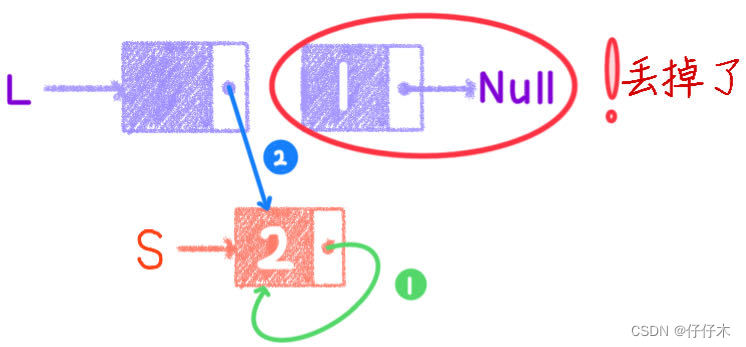
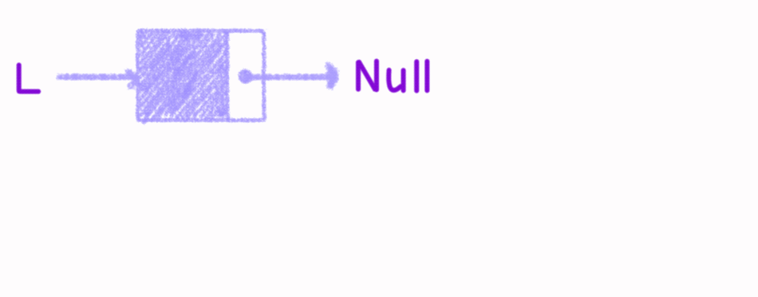
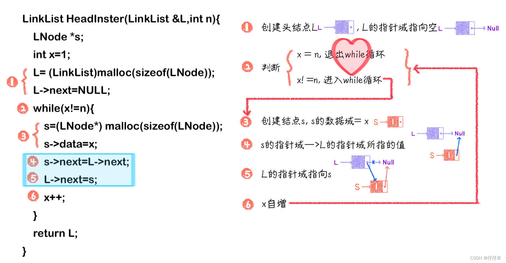
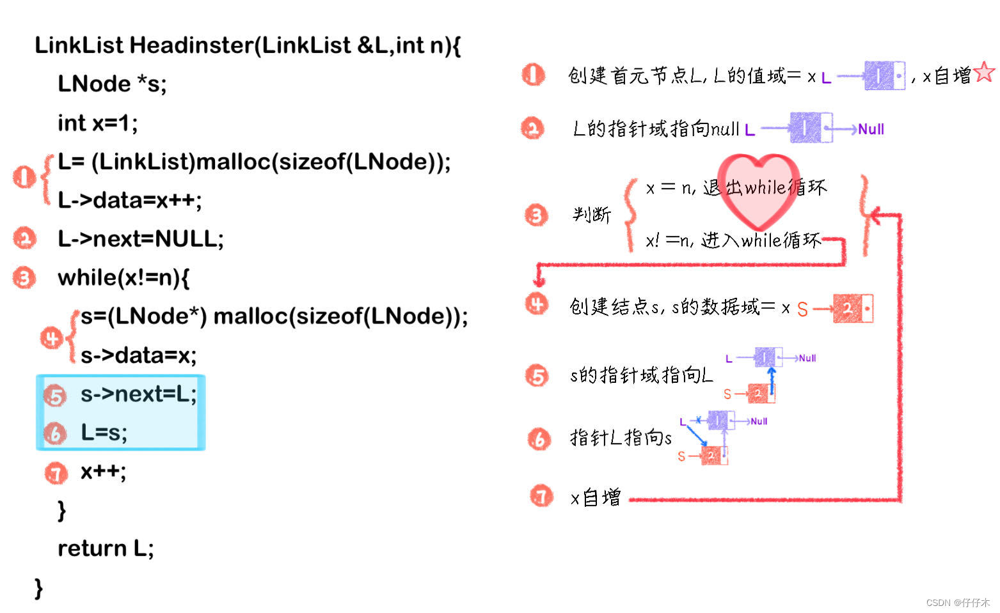
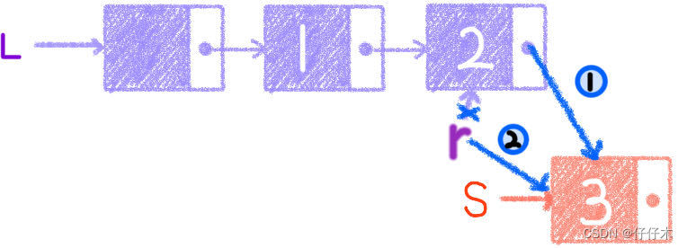
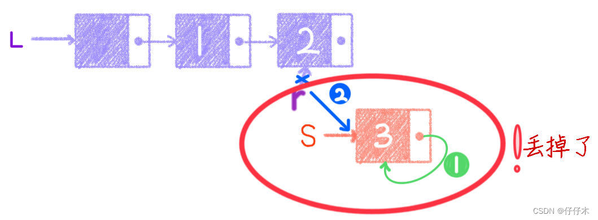
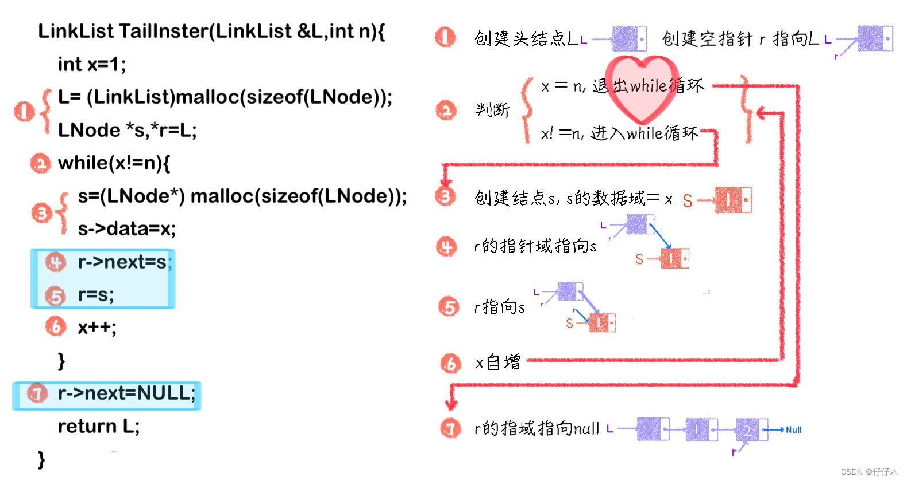
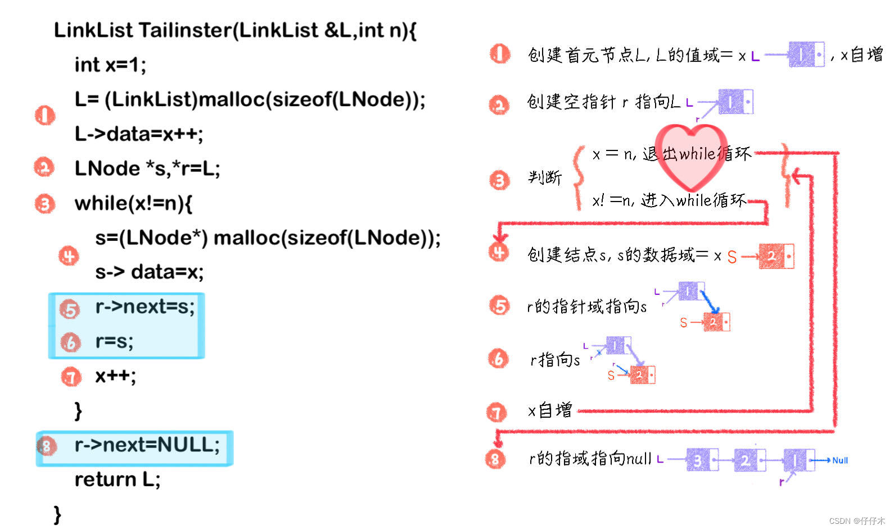
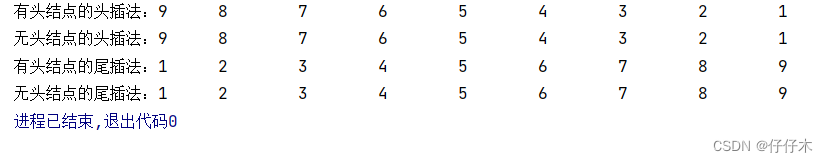

原文地址 [blog.csdn.net](https://blog.csdn.net/weixin_46629453/article/details/125643226) 
作者 仔仔木

#### 头插法和尾插法

*   [一、头插法](#_14)
*   *   *   [💤思考一：头插法的核心是什么❓](#_22)
        *   [❗❗ 重点一：以带头结点方式实现头插法](#______43)
        *   [❗❗ 重点二：以不带头结点方式实现头插法](#______68)
*   [二、尾插法](#_98)
*   *   *   [💤思考二：尾插法的核心是什么❓](#_103)
        *   [❗❗ 重点三：以带头结点方式实现尾插法](#______117)
        *   [❗❗ 重点四：以不带头结点方式实现尾插法](#______140)
*   [三、完整代码](#_164)
*   [四、运行结果图](#_296)

  
链表的定义

```
typedef int ElemType;
typedef struct LNode{
   ElemType data;           //数据域
   struct LNode *next;      //指针域
}LNode,*LinkList;

```

一、头插法
-----

1.  什么是头插法❓  
    在插入时，新的结点插入到当前链表的表头。
    
2.  怎么实现头插法❓
    
    > #### 💤思考一：头插法的核心是什么❓
    > 
    > 以有头结点为例：  
    > 只需要将新的节点插在头结点和首元结点之间。所以核心代码为:
    > 
    > ```
    > s->next=L->next;		①
    > L->next=s;				②
    > 
    > ```
    > 
    > * * *
    > 
    > **注意：①②能否交换顺序❓**  
    > 假设可以，那么代码为：`② L->next=s; ① s->next=L->next;`  
    > **先②后①图：**  
    >   
    > **千万不能交换呦**
    
    > #### ❗❗ 重点一：以带头结点方式实现头插法
    > 
    > 1.  动图：  
    >     
    > 2.  图解  
    >     
    > 3.  代码
    >     
    >     ```
    >     LinkList HeadInster(LinkList &L,int n){
    >     	LNode *s;
    >     	int x=1;
    >     	L= (LinkList)malloc(sizeof(LNode));     	//创建头结点
    >        	L->next=NULL;                               //初始为空链表
    >        	while(x!=n){
    >       		s=(LNode*) malloc(sizeof(LNode));   	//创建新结点
    >       		s->data=x;
    >      		s->next=L->next;						//核心代码
    >     		L->next=s;								//核心代码
    >     		x++;
    >      	}
    >      	return L;
    >     }
    >     
    >     ```
    >     
    
    > #### ❗❗ 重点二：以不带头结点方式实现头插法
    > 
    > 1.  动图解析  
    >     
    > 2.  图解  
    >     
    > 3.  代码
    >     
    >     ```
    >     LinkList Headinster(LinkList &L,int n){
    >         LNode *s;
    >         int x=1;
    >     	L= (LinkList)malloc(sizeof(LNode));
    >         L->data=x++;
    >         L->next=NULL;
    >         while(x!=n){
    >             s=(LNode*) malloc(sizeof(LNode));
    >             s->data=x;
    >             s->next=L;
    >             L=s;
    >             x++;
    >         }
    >         return L;
    >     }
    >     
    >     ```
    >     
    


二、尾插法
-----

1.  什么是尾插法❓  
    在插入时，新的结点插入到当前链表的表尾，为此必须增加一个尾指针`r`，使其始终指向当前链表的尾结点。
    
2.  怎么实现头插法❓
    
    > #### 💤思考二：尾插法的核心是什么❓
    > 
    > 以有头结点为例：  
    >   
    > 由图可知，
    > 
    > ```
    > r->next=s;			//①r的指针域指向S（让新结点插入到链表）
    > r=s;				//②r指针指向s（保持r指针一直在链表尾端，方便插入新的结点）
    > 
    > ```
    > 
    > * * *
    > 
    > **那上面两句可以交换吗❓**我们来试一试  
    >   
    > 还是不能交换呦
    
    > #### ❗❗ 重点三：以带头结点方式实现尾插法
    > 
    > 1.  动图解析  
    >     
    > 2.  图解  
    >     
    > 3.  代码
    >     
    >     ```
    >     LinkList TailInster(LinkList &L,int n){
    >     	int x=1;
    >     	L= (LinkList)malloc(sizeof(LNode));
    >     	LNode *s,*r=L;
    >     	while(x!=n){
    >        		s=(LNode*) malloc(sizeof(LNode));
    >        		s->data=x;
    >       	 	r->next=s;
    >        		r=s;
    >        		x++;
    >     	}
    >     	r->next=NULL;
    >     	return L;
    >     }
    >     
    >     ```
    >     
    
    > #### ❗❗ 重点四：以不带头结点方式实现尾插法
    > 
    > 1.  动图解析  
    >     （略，参考上）
    > 2.  图解  
    >     
    > 3.  代码
    >     
    >     ```
    >     LinkList Tailinster(LinkList &L,int n){
    >     	int x=1;
    >     	L= (LinkList)malloc(sizeof(LNode));
    >     	L->data=x++;
    >     	LNode *s,*r=L;
    >     	while(x!=n){
    >         	s=(LNode*) malloc(sizeof(LNode));
    >         	s->data=x;
    >         	r->next=s;
    >         	r=s;
    >         	x++;
    >     	}
    >     	r->next=NULL;
    >     	return L;
    >     }
    >     
    >     ```
    >     
    

三、完整代码
------

```
#include "stdio.h"
#include "stdlib.h"

typedef int ElemType;
typedef struct LNode{
   ElemType data;           //数据域
   struct LNode *next;      //指针域
}LNode,*LinkList;

/*
 * 头插法 有头结点
 */
LinkList HeadInster(LinkList &L,int n){
    LNode *s;
    int x=1;
    L= (LinkList)malloc(sizeof(LNode));     //创建头结点
    L->next=NULL;                                //初始为空链表
    while(x!=n){
        s=(LNode*) malloc(sizeof(LNode));   //创建新结点
        s->data=x;
        s->next=L->next;
        L->next=s;
        x++;
    }
    return L;
}

/*
 * 头插法 无头结点
 */
LinkList Headinster(LinkList &L,int n){
    LNode *s;
    int x=1;
    L= (LinkList)malloc(sizeof(LNode));
    L->data=x++;
    L->next=NULL;
    while(x!=n){
        s=(LNode*) malloc(sizeof(LNode));
        s->data=x;
        s->next=L;
        L=s;
        x++;
    }
    return L;
}

/*
 * 尾插法、有结点
 */
LinkList TailInster(LinkList &L,int n){
    int x=1;
    L= (LinkList)malloc(sizeof(LNode));
    LNode *s,*r=L;
    while(x!=n){
        s=(LNode*) malloc(sizeof(LNode));
        s->data=x;
        r->next=s;
        r=s;
        x++;
    }
    r->next=NULL;
    return L;
}
/*
 * 尾插法、无结点
 */
LinkList Tailinster(LinkList &L,int n){
    int x=1;
    L= (LinkList)malloc(sizeof(LNode));
    L->data=x++;
    LNode *s,*r=L;
    while(x!=n){
        s=(LNode*) malloc(sizeof(LNode));
        s->data=x;
        r->next=s;
        r=s;
        x++;
    }
    r->next=NULL;
    return L;
}


/*
 * 便利链表、头结点
 */
void PrintList(LinkList L){
    LNode *s;
    s=L->next;
    while (s!=NULL) {
        printf("%d\t",s->data);
        s=s->next;
    }
}

/*
 * 便利链表
 */
void Print(LinkList L){
    LNode *s;
    s=L;
    while (s!=NULL) {
        printf("%d\t",s->data);
        s=s->next;
    }
}

int main(){
    LinkList L,S,P,Q;
    printf("有头结点的头插法：");
    HeadInster(L,10);
    PrintList(L);

    printf("\n无头结点的头插法：");
    Headinster(P,10);
    Print(P);
    
    printf("\n有头结点的尾插法：");
    TailInster(S,10);
    PrintList(S);

    printf("\n无头结点的尾插法：");
    Tailinster(Q,10);
    Print(Q);

}

```

四、运行结果图
-------

